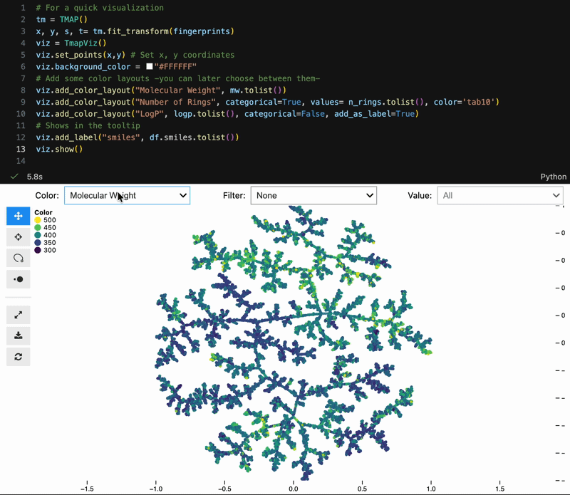
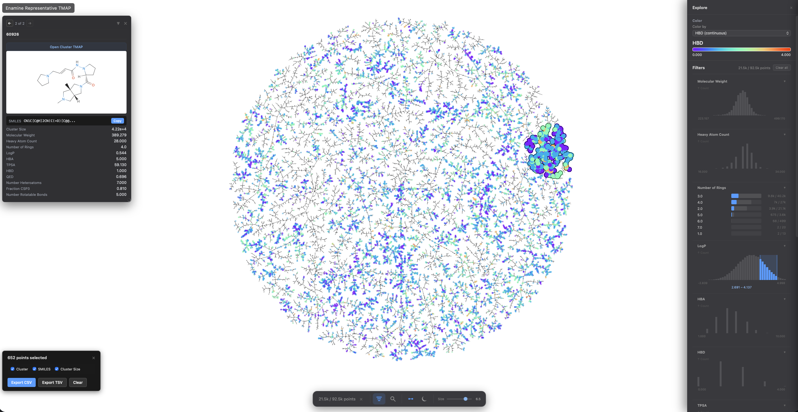

[](https://github.com/afloresep/TMAP/actions/workflows/tests.yml)
[](https://www.python.org/downloads/)

# TMAP

> **🚧 UNDER ACTIVE DEVELOPMENT 🚧**
>
> This is a modernized reimplementation of the original TMAP library. Core features are working, but the API may change before v1.0.
>
> **Current scope:**
>
> - Tree layout only
> - `jaccard`, `cosine`, `euclidean`, and `precomputed` metrics
> - `transform()` and `add_points()` are available

**TMAP** creates beautiful, interactive visualizations of high-dimensional data by organizing similar items into tree structures. Perfect for chemical space, embeddings, or any high-dimensional dataset.

```text
Your Data → [MinHash → LSHForest] (jaccard) → k-NN Graph → MST → OGDF Layout → Interactive Visualization
            [USearch] (cosine / euclidean)    
```

## Installation

### Recommended

```bash
git clone https://github.com/afloresep/TMAP.git
cd TMAP
python -m pip install .
```

Optional extras for common workflows:

```bash
python -m pip install rdkit jupyter-scatter
```

- `rdkit` is needed for chemistry helpers such as `fingerprints_from_smiles` and `molecular_properties`.
- `jupyter-scatter` is only needed for notebook widgets.
- `usearch` is installed automatically and provides the dense nearest-neighbor backend for `cosine` and `euclidean`.

### Build Notes

- Python **3.12+**
- A C++ compiler is still needed because the OGDF extension is built during install.
- On macOS, install the Xcode command-line tools first with `xcode-select --install`.

## Two API Styles

TMAP now has two main ways to work:

### 1. Recommended: sklearn-style estimator

Use this when you want the shortest path from data to map:

```python
from tmap import TMAP

model = TMAP(metric="jaccard", n_neighbors=20, kc=50, seed=42).fit(X)
viz = model.to_tmapviz()
viz.write_html("map.html")
```

This is the right path for most users.

### 2. Lower-level legacy-compatible pipeline

Use this when you want direct control over MinHash, LSH, or the layout stages:

```python
from tmap import LSHForest, MinHash
from tmap.layout import LayoutConfig, layout_from_lsh_forest

mh = MinHash(num_perm=128, seed=42)
signatures = mh.batch_from_binary_array(X)

lsh = LSHForest(d=128, l=64)
lsh.batch_add(signatures)
lsh.index()

cfg = LayoutConfig(k=20, kc=50, deterministic=True, seed=42)
x, y, s, t = layout_from_lsh_forest(lsh, cfg)
```

This path is useful if you are coming from the original TMAP workflow or if you want to tune the hashing and indexing stages directly.

Related pieces in the lower-level API:

- `MinHash.from_binary_array`, `batch_from_binary_array`
- `MinHash.from_sparse_binary_array`, `batch_from_sparse_binary_array`
- `MinHash.from_string_array`, `batch_from_string_array`
- `LSHForest`, `get_knn_graph`
- `layout_from_lsh_forest`, `layout_from_knn_graph`, `tree_from_knn_graph`

## Visualization Features

### Notebook Controls for Color + Filter



`TmapViz` now supports built-in notebook controls for:
- Color layout switching
- Categorical filtering
- Lasso/selection workflows with pandas-backed metadata

```python
scatter = viz.to_widget(width=1000, height=620, controls=True)
scatter.show()
```

### Deterministic, Reproducible Layouts

Same input and same seed produce the same topology and coordinates.

```python
from tmap import TMAP

x, y, s, t = TMAP(seed=42).fit_transform(fingerprints)
```

### Cleaner Visualization API

Add multiple layouts once, then switch them interactively in the notebook UI:

```python
viz.add_color_layout("Molecular Weight", mw.tolist(), categorical=False)
viz.add_color_layout("Number of Rings", n_rings.tolist(), categorical=True, color="tab10")
viz.add_color_layout("LogP", logp.tolist(), categorical=False, add_as_label=True)
viz.add_label("SMILES", df.smiles.tolist())

# Includes color/filter controls
viz.show(width=1000, height=620, controls=True)
```

### Lasso Selection + DataFrame Integration


### Improved Exported HTML



The HTML viewer supports:

- `Shift + drag` to lasso-select points
- light and dark theme toggle
- filter and search side panels
- pinned cards for metadata, structures, and links

The screenshots and gifs in this section can be refreshed later without changing the API.

### Also Improved

- Handles large datasets (binary mode for compact HTML payloads)
- Better notebook interactivity via `jupyter-scatter`
- High-level sklearn-style estimator (`TMAP`) plus lower-level modular pipeline

**Notes:**

- The import name is `tmap`. If you need the original C++ `tmap` package, use a separate virtualenv to avoid conflicts.
- OGDF layout is required. There is currently no pure-Python layout fallback.
- OGDF is built from the bundled `extern/ogdf` submodule during install.
- `datasketch` and `xxhash` are part of the core install so weighted and string-token MinHash workflows work out of the box.

## 🚀 Quick Start

### Fastest Way: Use The Estimator

```python
import numpy as np
from tmap import TMAP

# Binary fingerprints
X = np.random.randint(0, 2, (1000, 2048), dtype=np.uint8)
model = TMAP(metric="jaccard", n_neighbors=20).fit(X)
coords = model.embedding_
model.to_html("tmap.html")
```

```python
import numpy as np
from tmap import TMAP

# Dense embeddings
X = np.random.random((1000, 128)).astype(np.float32)
model = TMAP(metric="cosine", n_neighbors=20, store_index=True).fit(X)
new_coords = model.transform(X[:10])
```

### Complete Example: Molecular Visualization

```python
from tmap import MinHash, LSHForest
from tmap.layout import layout_from_lsh_forest, LayoutConfig
from tmap.visualization import TmapViz
import numpy as np

# 1. Encode your binary data (e.g., molecular fingerprints)
fingerprints = np.random.randint(0, 2, (1000, 2048), dtype=np.uint8)

mh = MinHash(num_perm=128, seed=42)
signatures = mh.batch_from_binary_array(fingerprints)

# 2. Build LSH Forest index
lsh = LSHForest(d=128, l=64)
lsh.batch_add(signatures)
lsh.index()

# 3. Compute layout
cfg = LayoutConfig()
cfg.k = 20              # k-nearest neighbors
cfg.kc = 50             # Search multiplier
cfg.fme_iterations = 1000
cfg.deterministic = True
cfg.seed = 42

x, y, s, t = layout_from_lsh_forest(lsh, cfg)

# 4. Create interactive visualization
viz = TmapViz()
viz.title = "My TMAP"
viz.set_points(x, y)

# Add color by some property
viz.add_color_layout("Property", your_property_values, categorical=False)

# Save (auto-selects binary mode for large datasets)
viz.write_html("output.html")

# Notebook mode (optional)
viz.show(width=1000, height=620, controls=True)
```

### Simpler Example: Just the Layout

```python
import numpy as np
from tmap import MinHash, LSHForest
from tmap.layout import layout_from_lsh_forest, LayoutConfig

# Binary data
X = np.random.randint(0, 2, (100, 512), dtype=np.uint8)

# Encode → Index → Layout
mh = MinHash(num_perm=128, seed=42)
sigs = mh.batch_from_binary_array(X)

lsh = LSHForest(d=128, l=64)
lsh.batch_add(sigs)
lsh.index()

cfg = LayoutConfig(k=10, seed=42, deterministic=True)
x, y, s, t = layout_from_lsh_forest(lsh, cfg)

# x, y = node coordinates
# s, t = tree edges (source, target indices)
```

## Tutorials

Recommended tutorials and examples:

- [`examples/cluster_65053_tmap.py`](examples/cluster_65053_tmap.py)
  Canonical molecule example with SMILES, properties, HTML export, and `serve()`.
- [`notebooks/01_quickstart.ipynb`](notebooks/01_quickstart.ipynb)
  Fastest estimator-based workflow.
- [`notebooks/02_minhash_deep_dive.ipynb`](notebooks/02_minhash_deep_dive.ipynb)
  MinHash methods and the different `from_*` and `batch_from_*` entry points.
- [`notebooks/03_legacy_lsh_pipeline.ipynb`](notebooks/03_legacy_lsh_pipeline.ipynb)
  Lower-level `MinHash` + `LSHForest` + `layout_from_lsh_forest` workflow.
- [`notebooks/06_metric_guide.ipynb`](notebooks/06_metric_guide.ipynb)
  When to use `jaccard`, `cosine`, `euclidean`, and `precomputed`.
- [`notebooks/08_cheminformatics.ipynb`](notebooks/08_cheminformatics.ipynb)
  Estimator-first chemistry workflow on `cluster_65053.csv`.
- [`notebooks/11_card_configuration.ipynb`](notebooks/11_card_configuration.ipynb)
  How to build useful pinned cards for molecule maps.

## 📖 Documentation

Comprehensive guides are available in the [`docs/`](docs/) directory:

| Guide | Description |
|-------|-------------|
| [**Documentation Index**](docs/index.md) | Start here! Overview and getting started |
| [MinHash Guide](docs/minhash_guide.md) | Understanding MinHash encoding and choosing parameters |
| [LSHForest Guide](docs/lshforest_guide.md) | Building the index, query methods, k-NN construction |
| [Graph Guide](docs/graph_guide.md) | MST construction, tree traversal, bias factor tuning |
| [Layout Guide](docs/layout_guide.md) | OGDF layout configuration, parameter tuning, determinism |
| [Visualization Guide](docs/visualization_guide.md) | Creating interactive visualizations with TmapViz |
| [API Reference](docs/api_reference.md) | Complete API documentation |

## 🧪 Development

### Running Tests

```bash
# Run all tests
pytest -v

# Run specific test file
pytest tests/test_lshforest.py -v

# Run without OGDF tests (faster)
pytest -v --ignore=tests/test_layout_ogdf.py
```

### Code Quality

```bash
# Format code
ruff format src/ tests/

# Lint
ruff check src/ tests/

# Type check
mypy src/
```

### Benchmarks

```bash
# Benchmark new implementation
python scripts/benchmark_new_tmap.py

# Compare with original (requires separate venv with old tmap)
python scripts/benchmark_old_tmap.py
```

## 🏗️ Architecture

TMAP2 is built with a modular, composable architecture:

```python
# Each stage is independent and swappable
Data → Encoder (MinHash) → Index (LSHForest) → Graph (MST) → Layout (OGDF) → Viz (TmapViz)
```

**Key Design Principles:**

- **Deterministic**: Same input + seed = same output
- **Type-safe**: Full type hints, validated with mypy
- **Testable**: High test coverage with clear test cases
- **Extensible**: Strategy pattern allows swapping implementations

## 📄 License

MIT License - see [LICENSE](LICENSE) file for details.
