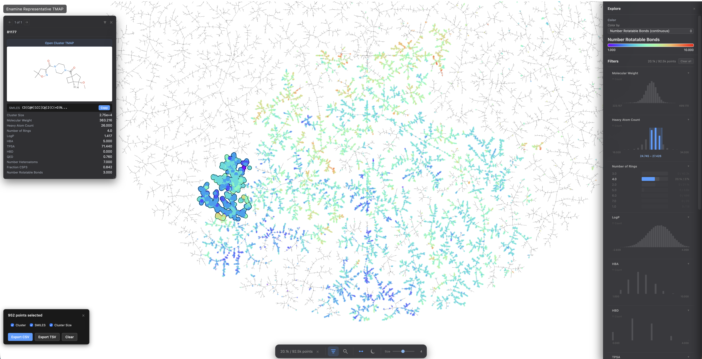
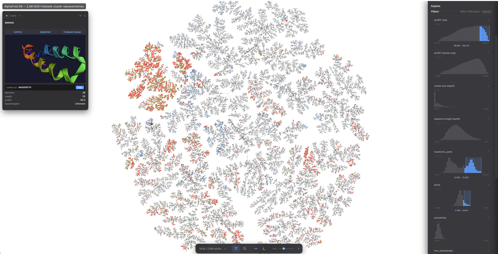

[](https://github.com/afloresep/tmap2/actions/workflows/tests.yml)
[](https://pypi.org/project/tmap2/)
[](https://www.python.org/downloads/)

# TMAP2

Tree-based visualization for high-dimensional data. Organizes similar items into interactive tree structures. Ideal for chemical space, protein embeddings, single-cell data, or any high-dimensional dataset.

<table>
  <tr>
    <td></td>
    <td></td>
  </tr>
</table>

## Why Trees?

Most dimensionality reduction tools (UMAP, t-SNE, PCA) produce point clouds. TMAP produces a **tree**, a connected structure where every point is linked to its neighbors through branches. This makes the layout itself explorable because you can follow branches, trace paths between any two points, and discover how regions connect.

For example, in a TMAP of pet breed images, following the branch from terriers toward cats reveals that the bridge between the two groups runs through chihuahuas and sphynx cats (the bald ones) which is both hilarious and logical since both are small, have short hair, big eyes... The tree doesn't just cluster similar things it also shows you *how* dissimilar things are connected.

<p align="center">
  
</p>

Because the layout is a tree, you get operations that point clouds can't support:

```python
path = model.path(idx_a, idx_b)        # nodes along the tree path
d = model.distance(idx_a, idx_b)        # sum of edge weights along the path
n = model.hops(idx_a, idx_b)            # number of tree edges between two points
pseudotime = model.distances_from(idx)  # tree distance from one point to all others
```

The same path tracing and tree-distance colouring are available inside the interactive HTML: pin two points and the inspector lists the path, or colour the whole map by tree distance from a selected point.

## Installation

```bash
pip install tmap2
```

Wheels are published for Linux x86_64, macOS arm64 (Apple Silicon), and Windows x86_64 on Python 3.11 to 3.13. Other platforms build the OGDF layout extension from source and need CMake and a C++17 compiler.

Optional extras:

```bash
pip install rdkit # chemistry helpers (fingerprints_from_smiles, molecular_properties)
pip install jupyter-scatter # notebook interactive widgets
pip install biopython # protein helpers (ProtParam properties, PDB parsing)
```

> **Note:** The import name is `tmap`, not `tmap2`.

## Quick Start 

### Binary Data (e.g. Chemical Fingerprints)

```python
from tmap.utils import fingerprints_from_smiles
from tmap import TMAP

smiles = [...]  # your SMILES list
# Binary fingerprints (Jaccard distance). `valid` flags the SMILES RDKit could parse,
# so you can drop the same rows from any labels or properties you attach later.
fps, valid = fingerprints_from_smiles(smiles, fp_type="morgan", radius=2, n_bits=2048, return_valid=True)
model = TMAP(metric="jaccard", n_neighbors=20).fit(fps)
viz = model.to_tmapviz()
viz.write_html("map.html")  # interactive HTML, open in a browser
# viz.show()                # or render inline in a Jupyter notebook
```

### Continuous Vectors (e.g. Protein Embeddings)

```python
import numpy as np
from tmap import TMAP

# embeddings (use cosine / euclidean distances)
X = np.random.random((1000, 128)).astype(np.float32)
model = TMAP(metric="cosine", n_neighbors=20).fit(X)
viz = model.to_tmapviz()
viz.show()                    # inline in a Jupyter notebook
# viz.write_html("tmap.html") # or save as interactive HTML
```

## Key Features

- **Tree structure**: follow branches, trace paths, count hops, compute pseudotime
- **Always one tree**: a too-low `n_neighbors` can fragment the kNN graph; TMAP bridges the pieces so `path` and `distance` stay defined (`connect_components=True`, inspect with `n_components_`)
- **Deterministic**: the layout is always seeded and deterministic. For cosine/euclidean, pass `reproducible=True` to also make the HNSW index build bit-identical across runs (slower)
- **Multiple metrics**: `jaccard`, `cosine`, `euclidean`, `precomputed`, or bring your own kNN graph
- **Incremental**: `add_points()` and `transform()` for adding new data into an existing TMAP
- **Model persistence**: `save()` / `load()`
- **Three viz backends**: interactive HTML, jupyter-scatter, matplotlib

## Visualization (add colors, labels...) 

**Notebook widgets**:  color switching, categorical filtering, and lasso selection with pandas-backed metadata:

### Add Colors & Labels

Adding colors is quite simple. Just pass the name of the layout (e.g. Molecular Weight, Age, Protein Lenght ...), a list of values for each node and matplotlib color. 
If the data is categorical (e.g. Age or Heavy Atom Count) pass `categorical=True` so that categorical colors like `tab10` become available.
To add labels (i.e. data that is not needed for coloring the nodes) just pass a name for the labels and the list of values. 

```python
model = TMAP(metric="jaccard").fit(X)
viz = model.to_tmapviz() 
viz.add_color_layout("Molecular Weight", mw.tolist(), categorical=False) 
viz.add_color_layout("Scaffold", scaffolds, categorical=True, color="tab10")
viz.add_label("SMILES", smiles_list)
viz.show(width=1000, height=620, controls=True) # to see in jupyter notebook
# viz.write_html("mytmap.html") # to save and see as HTML in the browser
```
> Here SMILES are added as a plain label, so no 2D structure is drawn. To render structures in tooltips and cards, use `viz.add_smiles(smiles_list)` instead. For image datasets use `viz.add_images(paths_or_urls)`.

### Filters, cards and structures

```python
viz.add_filter("Ring Count", n_rings, categorical=True)   # filter-panel column without a colour map
viz.configure_column("UniProt ID", link_template="https://www.uniprot.org/uniprotkb/{value}")
viz.configure_card(title_column="Name", fields=["Molecular Weight", "Scaffold"])
viz.add_3d_structures(alphafold_urls, source="url", fmt="pdb")   # or add_3d_structure_files(local_paths)
```

`add_filter` puts a column in the filter panel without computing colours for it, which is cheaper than `add_color_layout` when you only want to filter. Colour layouts are always filterable. `configure_column` and `configure_card` control links, formatting and what the pinned card shows. `add_3d_structures` and `add_3d_structure_files` attach PDB or mmCIF structures that render in the card.

### Interactive HTML

`viz.write_html("name.html")` writes a self-contained page with lasso selection, light/dark theme, filter and search panels, pinned metadata cards, and a binary mode for large datasets. Selecting a point opens the **inspector**:

- **Neighbors**: the point's tree neighbours with similarity scores, property differences and structures or images. Hovering a neighbour highlights the connecting edge.
- **Path**: pin a second point to trace the tree path between them, listing each node with its step number and running tree distance.
- **Colour by tree distance**: colour the whole map by tree distance from the selected point, using the normal colour menu.

For publication figures use matplotlib: `model.plot_static(color_by=labels)`.

## Domain Utilities

Built-in helpers for common scientific workflows:

```python
from tmap.utils.chemistry import fingerprints_from_smiles, molecular_properties
from tmap.utils.proteins import fetch_uniprot, sequence_properties
from tmap.utils.singlecell import from_anndata
```

| Domain | Metric | Utilities |
|--------|--------|-----------|
| Chemoinformatics | `jaccard` | `fingerprints_from_smiles` (`return_valid=True` flags unparseable SMILES), `molecular_properties`, `murcko_scaffolds`, `reaction_properties` |
| Proteins | `cosine` / `euclidean` | `fetch_uniprot`, `fetch_alphafold`, `read_fasta`, `read_pdb`, `read_pdb_dir`, `read_protein_csv`, `sequence_properties`, `parse_alignment` |
| Single-cell | `cosine` / `euclidean` | `from_anndata`, `cell_metadata`, `marker_scores`, `obs_to_numeric`, `subset_anndata`, `sample_obs_indices` |
| Generic embeddings | `cosine` / `euclidean` / `precomputed` | No domain utils needed |

## Examples

Runnable scripts for chemistry, images, proteins and text live in [`examples/`](examples/README.md). The shortest one is:

```bash
python examples/chemistry/molecules_tmap.py --nrows 3000
```

## Notebooks

| Notebook | Topic |
|----------|-------|
| [01 Quickstart](notebooks/01_quickstart.ipynb) | Shortest end-to-end walkthrough on a small molecule table |
| [02 Cheminformatics](notebooks/02_cheminformatics.ipynb) | SMILES → fingerprints → interactive molecular map |
| [03 Continuous Embeddings](notebooks/03_continuous_embeddings.ipynb) | Cosine and euclidean on MNIST: when to use each |
| [04 What's New](notebooks/04_new_functionalities.ipynb) | `add_points`, `transform`, tree paths, save/load, external kNN |
| [05 Single-Cell](notebooks/05_single_cell.ipynb) | RNA-seq with PBMC 3k, pseudotime, UMAP comparison |
| [06 FAQ](notebooks/06_faq.ipynb) | Troubleshooting and common questions |
| [07 MinHash Deep Dive](notebooks/07_minhash_deep_dive.ipynb) | Encoding methods and when to use each |
| [08 Notebook Widgets](notebooks/08_jscatter_demo.ipynb) | Coloring, tooltips, lasso selection with jupyter-scatter |
| [09 Card Configuration](notebooks/09_card_configuration.ipynb) | Pinned card layout, fields, and links |
| [10 Protein Analysis](notebooks/10_protein_analysis.ipynb) | FASTA, ESM embeddings, AlphaFold |
| [11 USearch Jaccard](notebooks/11_usearch_jaccard.ipynb) | Native binary Jaccard backend (high recall, low memory) |
| [12 Legacy LSH Pipeline](notebooks/12_legacy_lsh_pipeline.ipynb) | Lower-level MinHash + LSHForest + layout workflow |
| [13 Local Protein Structures](notebooks/13_local_protein_structures.ipynb) | Pinned cards with locally stored PDB/mmCIF structures |
| [14 CAZyme Analysis](notebooks/14_cazyme_analysis.ipynb) | GH43 glycoside hydrolase family map, contributed example |

## Lower-Level Pipeline

For direct control over indexing, hashing, and layout, see the [legacy pipeline notebook](notebooks/12_legacy_lsh_pipeline.ipynb). The main building blocks:

```python
from tmap.index import USearchIndex           # dense / binary kNN
from tmap import MinHash, LSHForest           # Jaccard on sets / strings
from tmap.layout import LayoutConfig, layout_from_lsh_forest
```

```text
Your Data
   ├─→ Binary matrix ─────────→ USearch        (Jaccard / cosine / euclidean)
   └─→ Sets / strings ───────→ MinHash → LSHForest
                ↓
             k-NN Graph → MST → OGDF Tree Layout → Interactive Visualization
```

## Development

```bash
git clone https://github.com/afloresep/tmap2.git
cd tmap2
pip install ".[dev]"
pytest -v
```

## License

MIT License; see [LICENSE](LICENSE) for details.

## Citation

If you use TMAP2 in your research, please cite:

> **From Proteins and Molecules to Cats and Dogs: Visualization as Scalable Minimum Spanning Trees**  
> Alejandro Flores Sepúlveda, Maarten Boneschansker, Daniel Probst, Jean-Louis Reymond  
> *ChemRxiv*, 2026.  
> [https://doi.org/10.26434/chemrxiv.15008307/v1](https://doi.org/10.26434/chemrxiv.15008307/v1)

```bibtex
@article{floressepulveda2026tmap,
  title   = {From Proteins and Molecules to Cats and Dogs: Visualization as Scalable Minimum Spanning Trees},
  author  = {Flores Sepúlveda, Alejandro and Boneschansker, Maarten and Probst, Daniel and Reymond, Jean-Louis},
  year    = {2026},
  doi     = {10.26434/chemrxiv.15008307/v1},
  url     = {https://doi.org/10.26434/chemrxiv.15008307/v1},
  note    = {ChemRxiv preprint}
}
```
